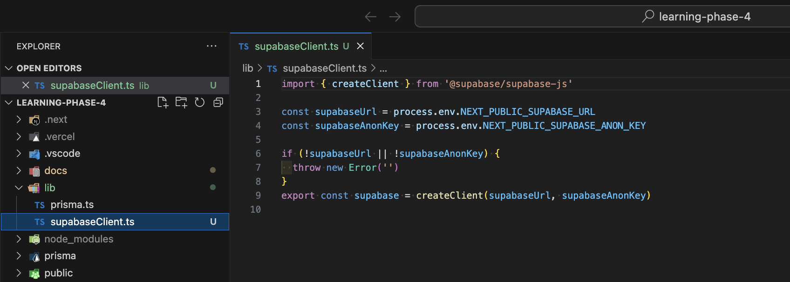
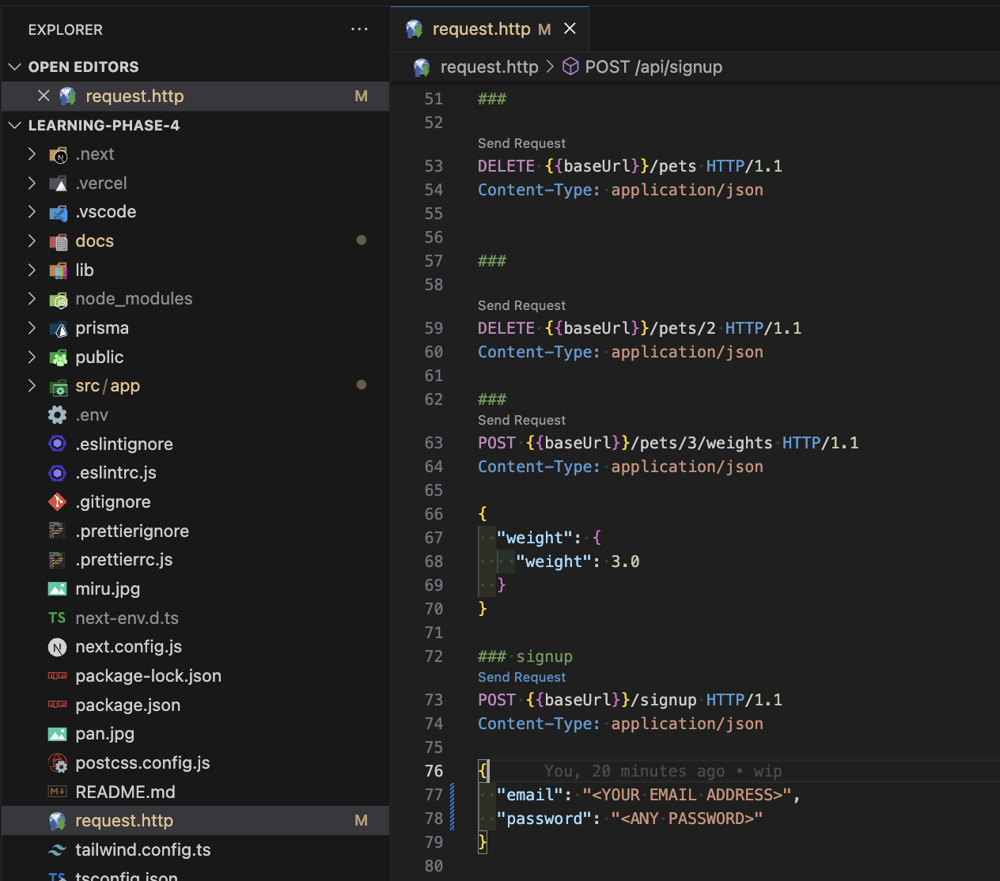
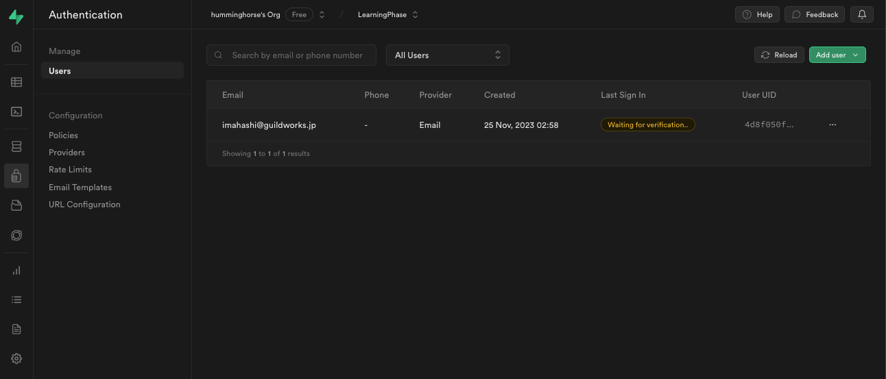
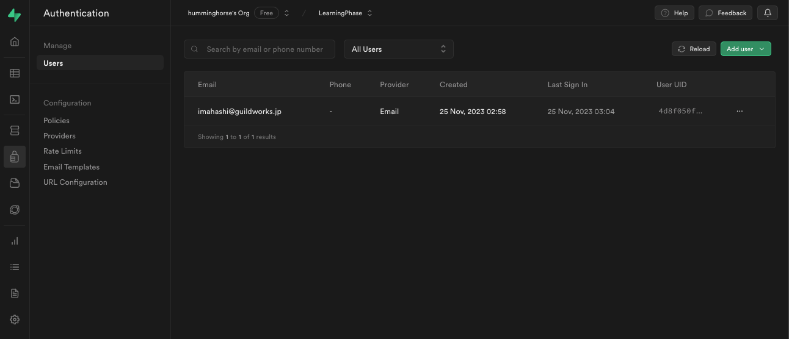
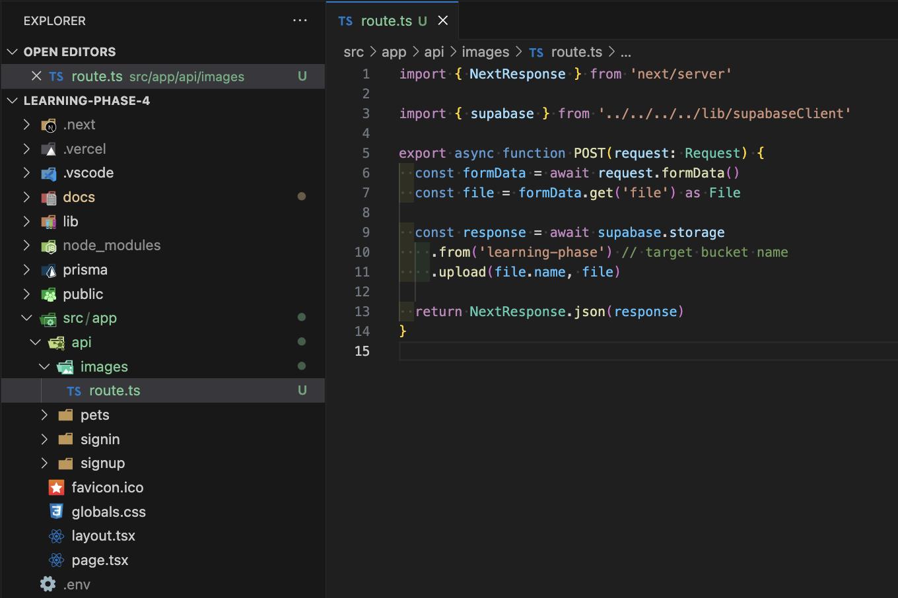
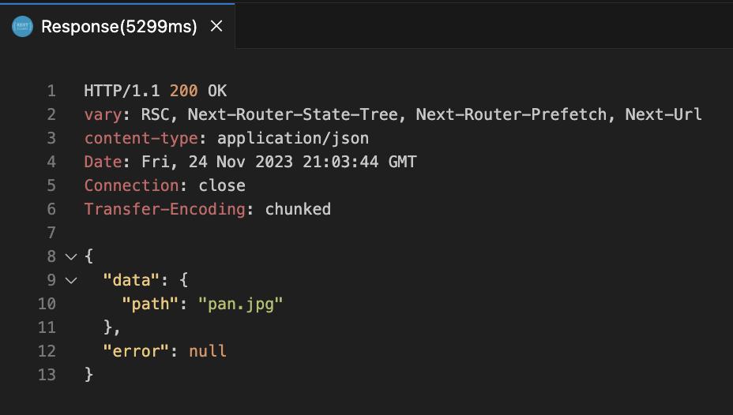

# 5. API開発応用編

## APIのカスタマイズ

### 一覧取得APIに検索条件を指定する
前回作成したペットの一覧取得APIで、名前を検索条件に指定して一覧を取得できるようにしましょう。

- `src/app/api/pets/route.ts` を以下のように修正してください。
  - `import { type NextRequest } from 'next/server'` を追加
  - `GET /api/pets` のAPIを以下のように変更します。
    ```
    // GET /api/pets
    export async function GET(request: NextRequest) {
      const searchParams = request.nextUrl.searchParams
      const queryName = searchParams.get('name')
      // findMany returns a list of records.
      const pets = await prisma.pet.findMany({
        // sort by id ascending
        orderBy: { id: 'asc' },
        // select only id, name, imageUrl, and owner.name
        select: { id: true, name: true, imageUrl: true, owner: { select: { name: true } } },
        where: queryName ? { name: { contains: queryName } } : undefined,
      })
      // return Response with pets to json
      return NextResponse.json({ pets })
    }
    ```
Diffは以下のようになります。


- request.httpに以下を追加して、SendRequestを実行してください。
  - `?name=MIAO` のMIAOが名前の検索キーワードになります。
```
### search pets by name

GET {{baseUrl}}/pets?name=MIAO HTTP/1.1
Content-Type: application/json
```


- Responseに、名前が検索キーワードを含むペットが返ってくればOKです。


## 認証
Supabaseを使って認証機能を実装しましょう。

### Supabaseの認証機能を使う準備
- Supabaseで Project Settings > API を開き、Project URLとProject API key(anon public)をコピーする

- Visual Studio Codeで.envを開き、以下2行を追加する
```
NEXT_PUBLIC_SUPABASE_URL=<Project URL>
NEXT_PUBLIC_SUPABASE_ANON_KEY=<Project API key(anon public)>
```


- 認証用にSupabaseのライブラリをインストール
```bash
npm install @supabase/supabase-js
```

- `lib` フォルダの配下に `supabaseClient.ts`というファイルを追加し、以下のコードをコピーする。

```
import { createClient } from '@supabase/supabase-js'

const supabaseUrl = process.env.NEXT_PUBLIC_SUPABASE_URL
const supabaseAnonKey = process.env.NEXT_PUBLIC_SUPABASE_ANON_KEY

if (!supabaseUrl || !supabaseAnonKey) {
  throw new Error('')
}
export const supabase = createClient(supabaseUrl, supabaseAnonKey)
```



これで。Supabaseの認証機能を使う準備ができました。

### Signup
まずは、Signupできるようにします。

- `src/app/api` 配下に `signup` フォルダを作成し、その中に `route.ts`というファイルを作成して、以下のコードを貼り付けてください。

```
import { NextResponse } from 'next/server'

import { supabase } from '../../../../lib/supabaseClient'

export async function POST(request: Request) {
  const requestUrl = new URL(request.url)
  const data = await request.json()
  const email = String(data.email)
  const password = String(data.password)

  const authResponse = await supabase.auth.signUp({
    email,
    password,
    options: {
      emailRedirectTo: `${requestUrl.origin}/auth/callback`,
    },
  })

  return NextResponse.json(authResponse)
}
```


- request.httpに以下を追記して、emailとpasswordの値を書き換えてから、SendRequestを実行してください。

```
### signup
POST {{baseUrl}}/signup HTTP/1.1
Content-Type: application/json

{
  "email": "<YOUR EMAIL ADDRESS>",
  "password": "<ANY PASSWORD>"
}
```



- 以下のようなResponseが表示されたらOKです。


- SupabaseでAuthentication > Usersを開くと、ユーザーが登録されていることが確認できます。


- 指定したメールアドレス宛に、Signupの確認を求めるメールが届きます。Confirm your mailをクリックしましょう。


- このような画面にリダイレクトされますが、アプリの画面を作っていないので、これでOKです。


- もう一度SupabaseでAuthentication > Usersを開くと、Last Sign Inの値が `Waiting for verification` から、メール内のConfirm your mailをクリックした日時に変わったことが確認できます。


### Signin
続いて、Signinできるようにします。

- `src/app/api` 配下に `signin` フォルダを作成し、その中に `route.ts`というファイルを作成して、以下のコードを貼り付けてください。

```
import { NextResponse } from 'next/server'

import { supabase } from '../../../../lib/supabaseClient'

export async function POST(request: Request) {
  const data = await request.json()
  const email = String(data.email)
  const password = String(data.password)

  const authTokenResponse = await supabase.auth.signInWithPassword({
    email,
    password,
  })

  return NextResponse.json(authTokenResponse.data.session)
}
```


- request.httpに以下を追記して、emailとpasswordの値を書き換えてから、SendRequestを実行してください。

```
### signin
POST {{baseUrl}}/signin HTTP/1.1
Content-Type: application/json

{
  "email": "<YOUR EMAIL ADDRESS>",
  "password": "<ANY PASSWORD>"
}
```


- 以下のようなResponseが表示されたらOKです。
  - Responseに含まれるaccess_tokenには本人確認に必要な情報が含まれており、これを使って、認証済の状態であることの確認が行われます。


- 参考: access_tokenをデコードすることで、ユーザ情報を取得できます。
  - デコードができるサイト: https://jwt.io/


## ファイルのアップロード
画像ファイルをアップロードできるAPIを作成しましょう。

### バケット(ファイルの保存先)の作成
- Supabaseで Storage > New Bucketを選択してください。


- Name of bucketに `learning-phase`と入力し、Public bucketをONにしてSaveしてください。


### ポリシー設定
初期状態ではセキュリティ設定でファイルアップロードができないので、許可設定を追加します。

- Policiesを開き、learning-phaseの右のNewPolicyボタンをクリックしてください。


- For full customizationを選択してください。


- 以下のように設定してください
  - Policy name: allow-all
  - Allowed operation: SELECT, INSERT, UPDATE, DELETE
  - Target roles: Default
  - Policy definition: Default


### 画像アップロードAPI
- `src/app/api` 配下に `images` フォルダを作成し、その中に `route.ts`というファイルを作成して、以下のコードを貼り付けてください。

```
import { NextResponse } from 'next/server'

import { supabase } from '../../../../lib/supabaseClient'

export async function POST(request: Request) {
  const formData = await request.formData()
  const file = formData.get('file') as File

  const response = await supabase.storage
    .from('learning-phase') // target bucket name
    .upload(file.name, file)

  return NextResponse.json(response)
}
```



- imagesフォルダを作成し、アップロードする画像を保存してください。どんな画像でもOKです。


- request.httpに以下を追記して、<YOUR FILE NAME>と <YOUR FILE PATH>の値を書き換えてから、SendRequestを実行してください。

```
### upload image
POST {{baseUrl}}/images HTTP/1.1
Content-Type: multipart/form-data; boundary=MyBoundary

--MyBoundary
Content-Disposition: form-data; name="file"; filename="<YOUR FILE NAME>"
Content-Type: image/jpeg

< <YOUR FILE PATH>
--MyBoundary--
```


- 以下のようなResponseが表示されたらOKです。


- Supabaseのlearning-phaseバケットの中に画像が保存されていることが確認できます。


### 演習: 画像の一覧取得API
こちらのlistメソッドを使ってlearning-phaseバケットのファイル一覧を取得取得するAPIを作成してみましょう。
https://supabase.com/docs/reference/javascript/storage-from-list


ヒント: listメソッドに渡すParametersは全てOptionalなので、省略して `list()` としてOKです。

## Vercel上のアプリへの反映
変更のCommit, Pushをしておきましょう。そうすることで、Vercel上のアプリにも反映をしておきましょう。
(やり方を忘れた人は、第4回レクチャーの資料を参考にしてください。)


