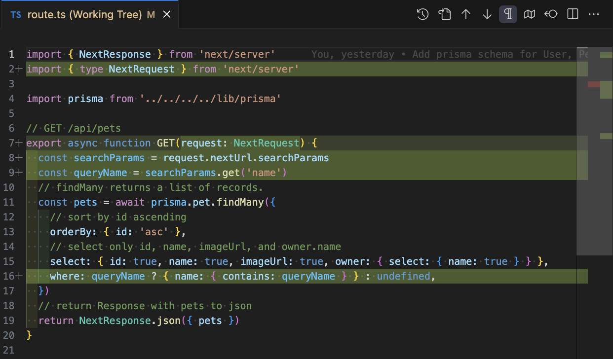
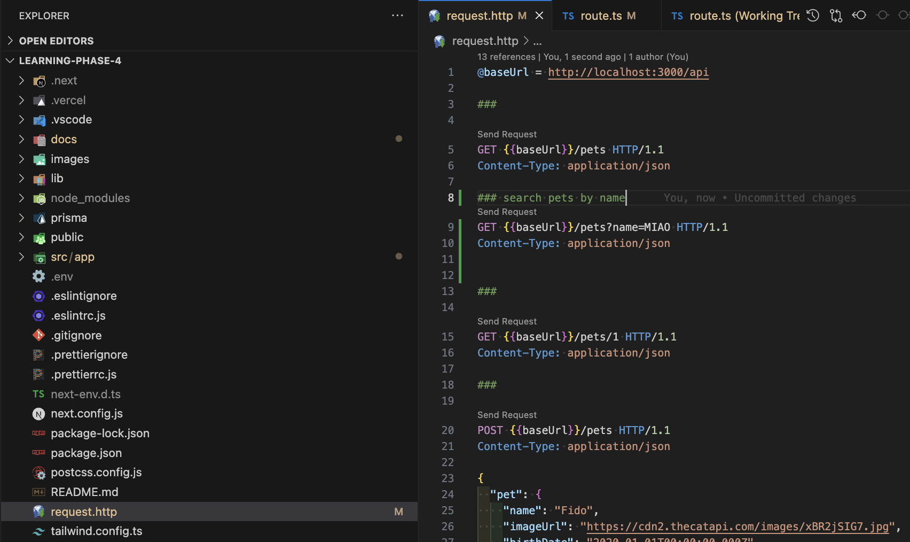
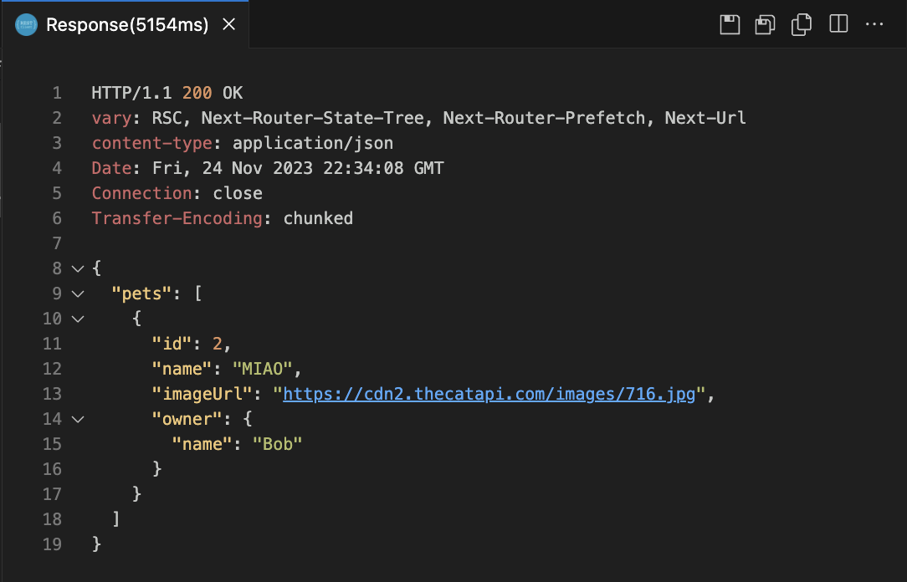
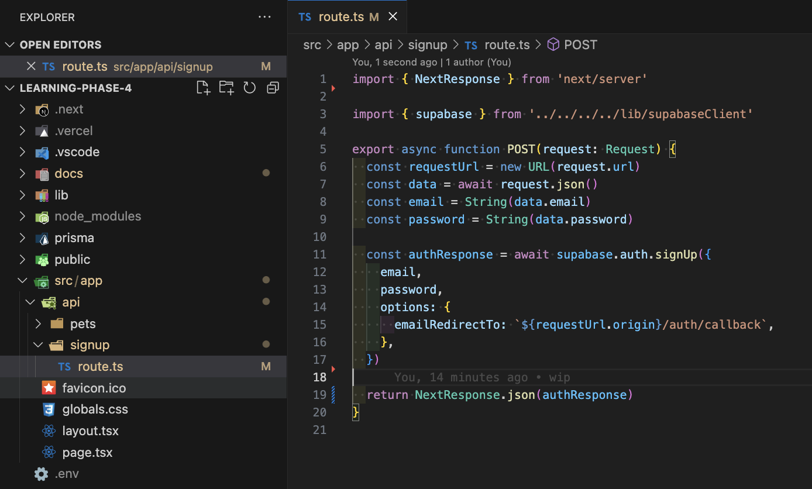
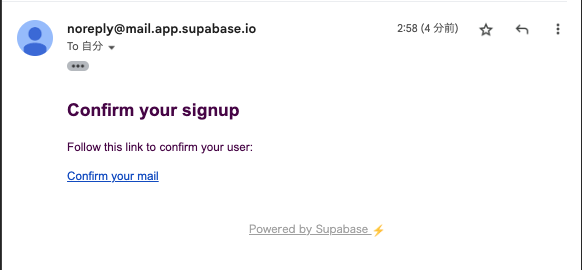
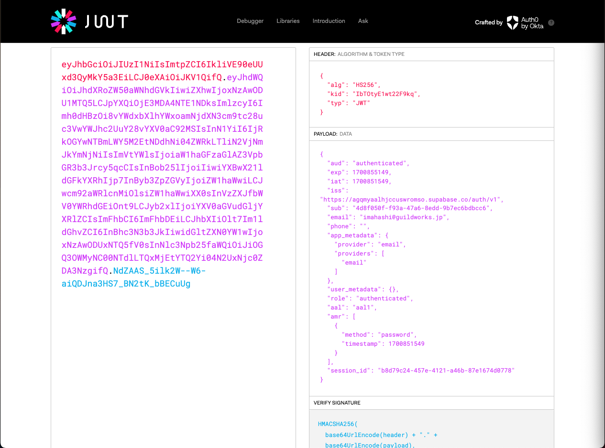
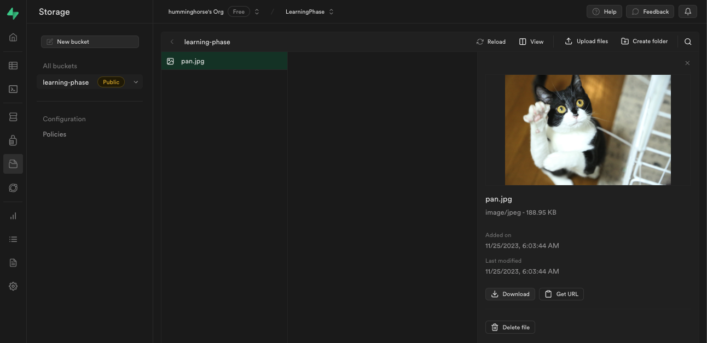
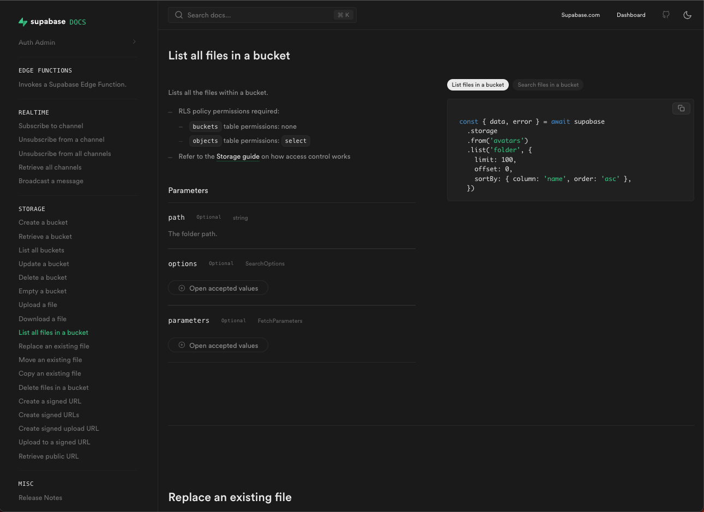

# 5. Advanced api development

## Customize API

### Specifying search conditions for the API to retrieve a list
Let's make it possible to retrieve a list of pets by specifying their names as search conditions in the API for retrieving a list of pets created in the previous lecture.

- Modify `src/app/api/pets/route.ts` as follows.
  - Add `import { type NextRequest } from 'next/server'`.
  - Modify the `GET /api/pets` API as follows.
    ```ts
    // GET /api/pets
    export async function GET(request: NextRequest) {
      const searchParams = request.nextUrl.searchParams
      const queryName = searchParams.get('name')
      // findMany returns a list of records.
      const pets = await prisma.pet.findMany({
        // sort by id ascending
        orderBy: { id: 'asc' },
        // select only id, name, imageUrl, and owner.name
        select: { id: true, name: true, imageUrl: true, owner: { select: { name: true } } },
        where: queryName ? { name: { contains: queryName } } : undefined,
      })
      // return Response with pets to json
      return NextResponse.json({ pets })
    }
    ```
Diff will be as follows.


- Add the following to `request.http` and run SendRequest.
  - `?name=MIAO` will be the search keyword for name.


```
### search pets by name
GET {{baseUrl}}/pets?name=MIAO HTTP/1.1
Content-Type: application/json
```



- If Response shows pets whose names contain the search keyword, it is OK.



## Authentication
Let's implement the authentication function using Supabase.

### Preparing to use Supabase's authentication functionality
- Open Project Settings > API in Supabase and copy the Project URL and Project API key (anon public)

- Open .env in Visual Studio Code and add the following two lines

```
NEXT_PUBLIC_SUPABASE_URL=<Project URL>
NEXT_PUBLIC_SUPABASE_ANON_KEY=<Project API key(anon public)>
```


- Install Supabase libraries for authentication

```bash
npm install @supabase/supabase-js
```

- Add a file named `supabaseClient.ts` under the `lib` folder and copy the following code.

```ts
import { createClient } from '@supabase/supabase-js'

const supabaseUrl = process.env.NEXT_PUBLIC_SUPABASE_URL
const supabaseAnonKey = process.env.NEXT_PUBLIC_SUPABASE_ANON_KEY

if (!supabaseUrl || !supabaseAnonKey) {
  throw new Error('')
}
export const supabase = createClient(supabaseUrl, supabaseAnonKey)
```


You are now ready to use the Supabase authentication feature.

### Signup
First of all, you need to enable Signup.

- Create a `signup` folder under `src/app/api`, create a file `route.ts` in it, and paste the following code.

```ts
import { NextResponse } from 'next/server'

import { supabase } from '../../../../lib/supabaseClient'

export async function POST(request: Request) {
  const requestUrl = new URL(request.url)
  const data = await request.json()
  const email = String(data.email)
  const password = String(data.password)

  const authResponse = await supabase.auth.signUp({
    email,
    password,
    options: {
      emailRedirectTo: `${requestUrl.origin}/auth/callback`,
    },
  })

  return NextResponse.json(authResponse)
}
```



- Add the following to `request.http`, rewrite the email and password values, and then execute SendRequest.

```
### signup
POST {{baseUrl}}/signup HTTP/1.1
Content-Type: application/json

{
  "email": "<YOUR EMAIL ADDRESS>",
  "password": "<ANY PASSWORD>"
}
```


- If you see a Response like the following, it is OK.


- Open Authentication > Users in Supabase and you will see that the user is registered.


- Click Confirm your mail in received email.



- You will be redirected to a screen like this, but since you have not created an application screen, this is OK.


- If you open Authentication > Users in Supabase again, you will see that the Last Sign In value has changed from `Waiting for verification` to the date and time you clicked Confirm your mail in the email.


### Signin
Next, we will make it possible to Signin.

- Create a `signin` folder under `src/app/api`, create a file `route.ts` in it, and paste the following code.

```ts
import { NextResponse } from 'next/server'

import { supabase } from '../../../../lib/supabaseClient'

export async function POST(request: Request) {
  const data = await request.json()
  const email = String(data.email)
  const password = String(data.password)

  const authTokenResponse = await supabase.auth.signInWithPassword({
    email,
    password,
  })

  return NextResponse.json(authTokenResponse.data.session)
}
```


- Add the following to `request.http`, rewrite the email and password values, and then execute SendRequest.

```
### signin
POST {{baseUrl}}/signin HTTP/1.1
Content-Type: application/json

{
  "email": "<YOUR EMAIL ADDRESS>",
  "password": "<ANY PASSWORD>"
}
```


- If you see a response similar to the one below, you are good to go.
  - The access_token in the response contains information necessary for identification, and this is used to confirm that the user has been authenticated.


- Note: User information can be obtained by decoding access_token.
  - Site where you can decode: https://jwt.io/



## Uploading files
Create an API that allows you to upload image files.

### Creating a bucket (file storage location)
- In Supabase, select Storage > New Bucket.


- Enter `learning-phase` in Name of bucket, turn on Public bucket and Save.


### Policy settings
In the initial state, file upload is not allowed in the security settings, so add a permission setting.

- Open Policies and click the NewPolicy button to the right of learning-phase.


- Select For full customization.


- Set as follows
  - Policy name: allow-all
  - Allowed operations: SELECT, INSERT, UPDATE, DELETE
  - Target roles: Default
  - Policy definition: Default


### Image Upload API
- Create a `images` folder under `src/app/api`, create a file `route.ts` in it, and paste the following code.

```ts
import { NextResponse } from 'next/server'

import { supabase } from '../../../../lib/supabaseClient'

export async function POST(request: Request) {
  const formData = await request.formData()
  const file = formData.get('file') as File

  const response = await supabase.storage
    .from('learning-phase') // target bucket name
    .upload(file.name, file)

  return NextResponse.json(response)
}
```


- Create an images folder and save the images you wish to upload. Any images are acceptable.


- Add the following to `request.http`, rewrite values of YOUR FILE NAME and YOUR FILE PATH, and then execute SendRequest.

```
### upload image
POST {{baseUrl}}/images HTTP/1.1
Content-Type: multipart/form-data; boundary=MyBoundary

--MyBoundary
Content-Disposition: form-data; name="file"; filename="<YOUR FILE NAME>"
Content-Type: image/jpeg

< <YOUR FILE PATH>
--MyBoundary--
```


- If you see a Response like the following, you are OK.


- You can confirm that the images are stored in the learning-phase bucket of Supabase.


### Exercise: API to get a list of images
Let's create an API to get a list of files in the learning-phase bucket using this list method.
https://supabase.com/docs/reference/javascript/storage-from-list



Tip: All Parameters passed to the list method are Optional, so you can omit them and use `list()`.

## Deploy to the application on Vercel
Commit and Push your changes. By doing so, you can deploy the changes to the app on Vercel.
(If you forget how to do this, please refer to the material in the 4th lecture.)
